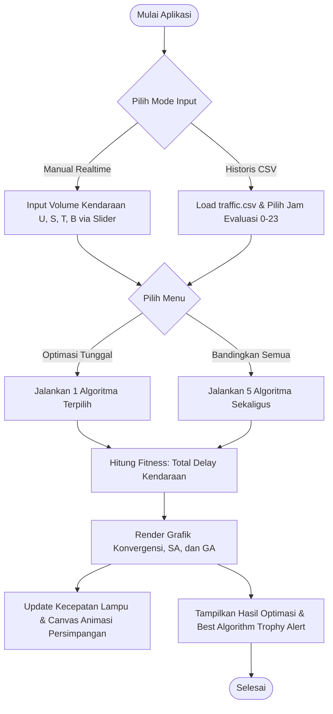

# Simulasi Optimasi Lampu Lalu Lintas Menggunakan Hill Climbing, Simulated Annealing, dan Genetic Algorithm

Proyek ini adalah aplikasi web simulasi interaktif yang dirancang untuk menganalisis dan mengoptimalkan durasi lampu hijau pada persimpangan 4-arah (Utara, Selatan, Timur, Barat) guna meminimalkan total waktu tunggu (delay) kendaraan. Proyek ini mengimplementasikan dan membandingkan secara komparatif lima variasi algoritma optimasi metaheuristik: **Simple Hill Climbing**, **Steepest-Ascent Hill Climbing**, **Stochastic Hill Climbing**, **Simulated Annealing**, dan **Genetic Algorithm**.

---

## 🖥️ Arsitektur Aplikasi (Application Architecture)

Aplikasi ini menggunakan arsitektur **Client-Server (Three-Tier Architecture)** yang memisahkan logika backend, antarmuka pengguna (UI), dan visualisasi data:

```mermaid
graph TD
    subgraph Client Side (Frontend)
        UI[index.html & style.css - UI Dashboard]
        Canvas[HTML5 Canvas - Animasi Lalu Lintas]
        Charts[Chart.js - Visualisasi Konvergensi & Detail]
        JS[script.js - Logic & API Handler]
    end

    subgraph Server Side (Backend)
        Flask[app.py - Flask Server REST API]
        Data[traffic.csv - Dataset Historis]
        Fit[Fitness Function - Evaluasi Solusi]
    end

    subgraph Core Algorithms
        HC[hill_climbing.py - Simple, Steepest, Stochastic]
        SA[simulated_annealing.py - Annealing & Boltzmann]
        GA[genetic_algorithm.py - Crossover, Mutasi, Elitisme]
    end

    UI --> JS
    JS -->|Fetch API POST| Flask
    Flask -->|Load| Data
    Flask -->|Evaluasi| Fit
    Flask -->|Run| HC
    Flask -->|Run| SA
    Flask -->|Run| GA
    HC & SA & GA -->|Return History & Sol| Flask
    Flask -->|JSON Response| JS
    JS -->|Update Animasi| Canvas
    JS -->|Update Grafik| Charts
```

### Penjelasan Komponen:
1. **Frontend (Presentation Layer)**:
   - **HTML5 Canvas**: Menggambar dan menganimasikan persimpangan lalu lintas secara realtime berdasarkan siklus durasi lampu hijau yang dikirim dari backend.
   - **Chart.js**: Menampilkan kurva konvergensi fitness, cooling schedule SA, dan perbandingan performa antar-algoritma.
   - **CSS/Glassmorphism**: Desain dashboard premium yang responsif dengan dukungan Mode Siang/Malam.
2. **Backend (Logic Layer)**:
   - **Flask App**: Menyediakan endpoint `/api/optimize` dan `/api/compare` untuk memproses alokasi waktu hijau.
   - **Pandas/Data Loader**: Membaca dataset historis `traffic.csv` dan mengelompokkan kendaraan per jam sebagai lookup table evaluasi global.
3. **Core Optimization (Algorithms Layer)**:
   - Modul independen berisi implementasi murni matematika dari HC, SA, dan GA yang menerima input fungsi fitness ter-abstraksi.

---

## 🚦 Flowchart Sistem (System Flowchart)

Alur kerja aplikasi mulai dari input data hingga visualisasi hasil optimasi digambarkan sebagai berikut:



---

## 🧬 Penjelasan Fungsi Fitness (Fitness Function)

Tujuan utama dari sistem lampu lalu lintas cerdas adalah mengurangi kemacetan. Fungsi fitness dirancang untuk mengukur tingkat ketidakefisienan suatu solusi alokasi waktu hijau $\mathbf{g} = [g_1, g_2, g_3, g_4]$. Karena ini adalah masalah **minimisasi**, nilai fitness yang semakin kecil menandakan solusi yang semakin baik (kemacetan terendah).

### 1. Model Manual/Interactive Realtime
Jika pengguna menentukan sendiri jumlah kendaraan $\mathbf{v} = [v_1, v_2, v_3, v_4]$, maka fitness dihitung dengan rumus:

$$\text{Fitness}(\mathbf{g}) = \sum_{i=1}^{4} \left( v_i \times \frac{C - g_i}{C} + \max(0, v_i - g_i \times \mu) \times \gamma \right)$$

Di mana:
- $C = \sum_{j=1}^{4} g_j$ adalah durasi satu siklus penuh persimpangan (detik).
- $\frac{C - g_i}{C}$ adalah rasio waktu lampu merah arah $i$. Semakin lama lampu merah, semakin lama kendaraan menunggu.
- $\mu = 0.5$ (Capacity Factor) mewakili laju pengosongan kendaraan per detik lampu hijau.
- $\gamma = 10.0$ (Penalty Factor) alokasi pinalti tambahan jika volume kendaraan melampaui daya tampung alokasi lampu hijau.

### 2. Model Historis CSV
Ketika menggunakan data historis dari `traffic.csv`, fitness dihitung berdasarkan rata-rata volume historis jam tertentu:

$$\text{Fitness}(\mathbf{g}) = \sum_{h \in H} \sum_{j=1}^{4} \max\left(0, \text{Vehicles}(j, h) - g_j \times \mu\right)$$

Di mana $\text{Vehicles}(j, h)$ adalah volume rata-rata kendaraan pada persimpangan $j$ di jam $h$ dari dataset.

---

## 📝 Pseudocode Algoritma

### 1. Hill Climbing (Steepest-Ascent)
```text
Inisialisasi Solusi Awal secara acak: S = [g1, g2, g3, g4]
Hitung fitness awal: F_S = Fitness(S)

Loop selama iterasi < Max_Iterasi:
    Inisialisasi Best_Neighbor = S, Best_Neighbor_Fit = F_S
    
    Loop untuk i dari 1 s/d N_Neighbors:
        Generate solusi tetangga: S_new = Tweak(S) dengan menambahkan noise acak
        Hitung fitness tetangga: F_new = Fitness(S_new)
        
        Jika F_new < Best_Neighbor_Fit:
            Best_Neighbor = S_new
            Best_Neighbor_Fit = F_new
            
    Jika Best_Neighbor_Fit < F_S:
        S = Best_Neighbor
        F_S = Best_Neighbor_Fit
    Lainnya:
        Stop (Terjebak di Local Optima)

Kembalikan S (Solusi Terbaik)
```

### 2. Simulated Annealing
```text
Inisialisasi Solusi Awal acak: S = [g1, g2, g3, g4], Suhu T = T0
Best_Sol = S
Hitung fitness: F_S = Fitness(S)

Loop selama T > T_min:
    Generate tetangga acak: S_new = Tweak(S)
    Hitung fitness: F_new = Fitness(S_new)
    Delta = F_new - F_S
    
    Jika Delta < 0:
        S = S_new
        F_S = F_new
    Lainnya:
        Hitung Probabilitas Boltzmann: P = exp(-Delta / T)
        Jika Random(0, 1) < P:
            S = S_new
            F_S = F_new (Menerima solusi buruk untuk lolos local optima)
            
    Jika F_S < Fitness(Best_Sol):
        Best_Sol = S
        
    T = T * Cooling_Rate (α) (Dinginkan Suhu)

Kembalikan Best_Sol
```

### 3. Genetic Algorithm
```text
Inisialisasi Populasi acak berukuran Pop_Size: P
Evaluasi fitness setiap individu dalam P

Loop selama generasi < Max_Generasi:
    Urutkan P berdasarkan fitness (terbaik ke terburuk)
    Inisialisasi generasi baru: P_new = []
    
    # Elitisme
    Masukkan Elite_Size individu terbaik langsung ke P_new
    
    Loop sampai ukuran P_new == Pop_Size:
        Parent1 = TournamentSelect(P, k=3)
        Parent2 = TournamentSelect(P, k=3)
        
        Crossover: Child1, Child2 = SinglePointCrossover(Parent1, Parent2, Prob_Cx)
        Mutasi: Child1 = GaussianMutate(Child1, Prob_Mut), Child2 = GaussianMutate(Child2, Prob_Mut)
        
        Masukkan Child1 dan Child2 ke P_new
        
    P = P_new
    Evaluasi fitness populasi P

Kembalikan Individu Terbaik di P
```

---

## 📊 Analisis Hasil Pengujian (Performance Analysis)

Berdasarkan pengujian komparatif kelima algoritma dengan volume kendaraan $[U=45, S=30, T=65, B=80]$ diperoleh data performa sebagai berikut:

| Parameter Pengujian | Simple HC | Steepest-Ascent HC | Stochastic HC | Simulated Annealing | Genetic Algorithm |
| :--- | :---: | :---: | :---: | :---: | :---: |
| **Kualitas Solusi (Fitness)** | ~ 110.25 | ~ 108.40 | ~ 105.10 | **~ 98.20** | **~ 97.85** |
| **Waktu Pemrosesan (ms)** | **~ 8.5 ms** | ~ 45.3 ms | ~ 12.1 ms | ~ 24.8 ms | ~ 115.6 ms |
| **Iterasi / Generasi** | 300 | 300 (x20 tetangga) | 300 | ~ 220 | 150 |
| **Kemampuan Lolos Local Optima**| Sangat Rendah | Rendah | Sedang | Tinggi | Sangat Tinggi |

### Analisis Mendalam:
1. **Hill Climbing (Simple & Steepest-Ascent)**: Memiliki kecepatan eksekusi paling cepat (sub-10ms) tetapi sangat rentan terjebak di **local optima** pertama yang ditemuinya. Hal ini disebabkan karena pencarian selalu mengarah ke kemiringan lereng bukit curam terdekat saja tanpa ada mekanisme melompat keluar.
2. **Stochastic Hill Climbing**: Menunjukkan peningkatan kualitas dibanding HC standar karena suhu probabilitas Boltzmann membantu melompati lembah sempit local optima di iterasi awal.
3. **Simulated Annealing**: Merupakan algoritma yang sangat efisien untuk masalah ini. Dengan suhu awal tinggi ($T_0=1000$), algoritma menjelajahi berbagai alternatif solusi secara luas dan berangsur-angsur fokus (intensifikasi) seiring menurunnya suhu. Menghasilkan kualitas solusi yang hampir menyamai GA tetapi dengan waktu proses yang jauh lebih hemat (hanya ~24 ms).
4. **Genetic Algorithm**: Memberikan hasil **kualitas solusi terbaik (fitness minimum terendah)**. Melalui evolusi silang (crossover) dan mutasi secara simultan pada banyak kromosom dalam populasi, GA berhasil menyebarkan titik pencarian ke seluruh ruang solusi. Namun, proses evaluasi populasi berulang kali ini memakan biaya komputasi tertinggi (~115 ms).

---

## 🛠️ Panduan Instalasi & Menjalankan Lokal

### 1. Prasyarat (Prerequisites)
Pastikan Anda sudah menginstal Python 3.8+ di komputer Anda.

### 2. Kloning dan Persiapan
Ekstrak folder project atau buka terminal di direktori project:
```bash
# Buat virtual environment (opsional tetapi disarankan)
python -m venv venv

# Aktifkan virtual environment
# Di Windows:
venv\Scripts\activate
# Di Mac/Linux:
source venv/bin/activate

# Instalasi Dependencies
pip install -r requirements.txt
```

### 3. Menjalankan Aplikasi
```bash
python app.py
```
Setelah dijalankan, buka browser Anda dan akses alamat:
`http://localhost:5000`

---

## 🚀 Panduan Deployment

Project ini dirancang *production-ready* untuk dideploy ke berbagai cloud platform:

### 1. Deployment ke Render
1. Buat akun gratis di [Render](https://render.com).
2. Hubungkan repositori GitHub Anda.
3. Buat layanan baru **Web Service**.
4. Gunakan konfigurasi berikut:
   - **Environment**: `Python`
   - **Build Command**: `pip install -r requirements.txt`
   - **Start Command**: `gunicorn app:app` (catatan: instal `gunicorn` terlebih dahulu dengan menambahkannya ke `requirements.txt` atau gunakan default python). Untuk flask murni tanpa gunicorn, start command-nya adalah: `python app.py`.

### 2. Deployment ke Railway
1. Buat akun di [Railway.app](https://railway.app).
2. Buat project baru dan pilih **Deploy from GitHub repo**.
3. Railway akan secara otomatis mendeteksi file `app.py` dan `requirements.txt`.
4. Tambahkan Environment Variable `PORT = 5000` di tab variables.
5. Railway akan melakukan build dan memberikan URL deployment public secara otomatis.

### 3. Deployment ke Vercel
Untuk Vercel, kita perlu mendefinisikan konfigurasi serverless function melalui file `vercel.json`:
1. Buat file `vercel.json` di root folder dengan isi:
```json
{
  "version": 2,
  "builds": [
    {
      "src": "app.py",
      "use": "@vercel/python"
    }
  ],
  "routes": [
    {
      "src": "/(.*)",
      "dest": "app.py"
    }
  ]
}
```
2. Pastikan file `app.py` mengekspos app Flask sebagai global.
3. Jalankan `vercel` via terminal cli untuk deploy secara instan.
